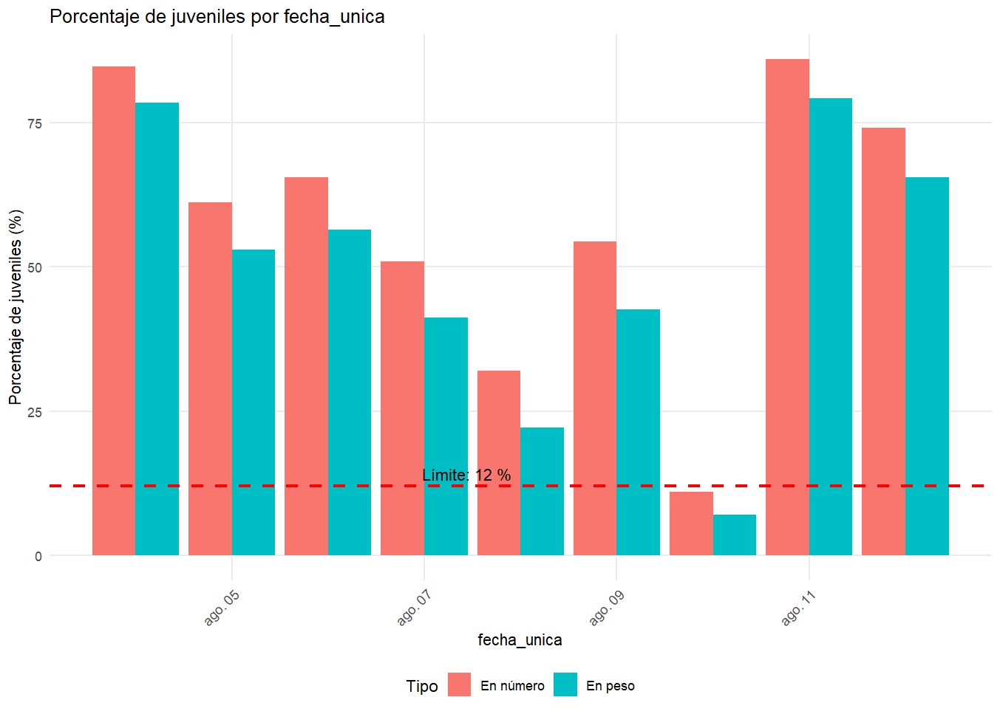
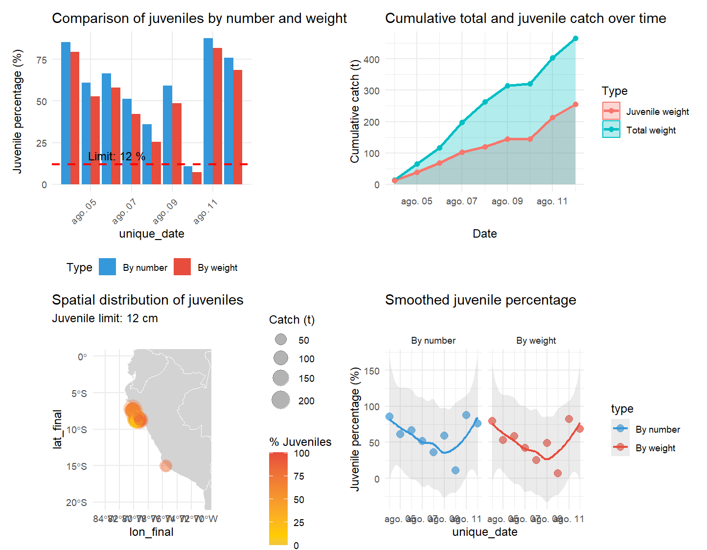
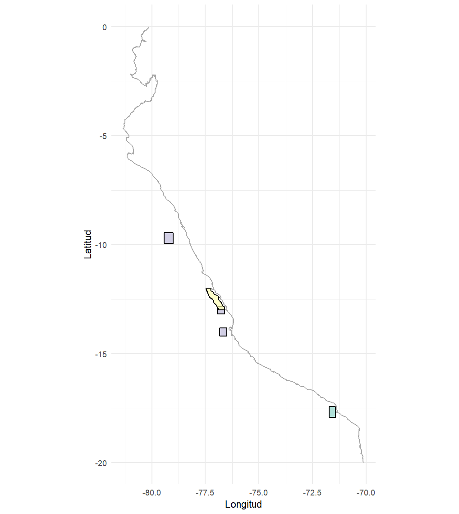
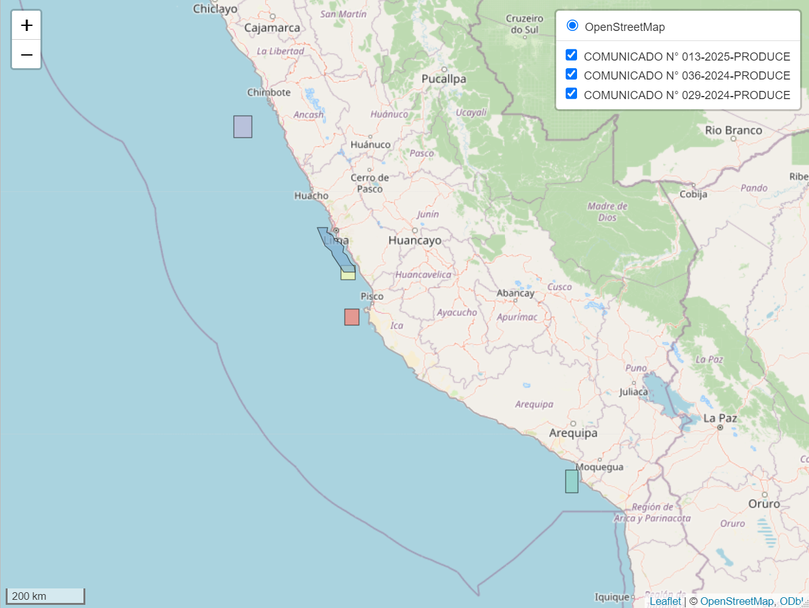

## Herramientas para el Análisis de Datos Pesqueros en Perú

`Tivy` es un paquete R especializado en el procesamiento y análisis de datos pesqueros del Perú. Facilita el manejo de información proveniente de bitácoras de faenas, registros de tallas, calas y comunicados oficiales emitidos por el Ministerio de Producción para cierres preventivos.

## 📋 Características principales

- Carga y procesamiento de datos de bitácoras pesqueras
- Integración de datos de calas, tallas y faenas
- Estimación de proporciones de juveniles
- Análisis de cierres preventivos
- Visualización interactiva de áreas de pesca y resultados
- Herramientas para modelado estadístico pesquero

## 📦 Instalación

Puedes instalar la versión en desarrollo de `Tivy` desde GitHub:

```r
# install.packages("devtools")
devtools::install_github("HansTtito/Tivy")
```

## 🚀 Ejemplos de uso

### Carga y procesamiento básico

```r
library(Tivy)

# Cargar y procesar archivos de bitácoras
data_calas <- procesar_calas(data_calas = calas_bitacora, 
                            formato = "xlsx", 
                            corregir_coordenadas = TRUE)

data_faenas <- procesar_faenas(data_faenas = faenas_bitacora, 
                              formato = "xlsx")

calas_tallas <- procesar_tallas(data_tallas = tallas_bitacora, 
                               formato = "xlsx")
```

### Integración de datos

```r
# Combinación de datos de tallas y faenas
data_tallasfaenas <- merge(x = data_faenas, 
                          y = calas_tallas, 
                          by = 'codigo_faena')

# Integración completa con datos de calas
data_total <- merge_tallas_faenas_calas(data_calas = data_calas, 
                                       data_tallas_faenas = data_tallasfaenas)

# Agregar variables derivadas
datos_final <- agregar_variables(data_total)
```

### Análisis de juveniles

```r
# Definir columnas de tallas
tallas_cols <- as.character(seq(8, 15, 0.5))

# Ponderar tallas según captura
datos_final_ponderados <- ponderar_tallas_df(
  datos_final, 
  tallas_cols = tallas_cols, 
  captura_col = 'catch_ANCHOVETA', 
  a = 0.0012,  # Parámetro a de relación longitud-peso
  b = 3.1242   # Parámetro b de relación longitud-peso
)

# Convertir fechas para agrupación temporal
datos_final_ponderados$fecha_unica <- convertir_a_fecha(
  datos_final_ponderados$fecha_inicio_cala, 
  tipo = "date"
)

# Calcular proporción de juveniles por fecha
resultado_juveniles <- juveniles_por_grupo(
  data = datos_final_ponderados, 
  group_cols = c("fecha_unica"), 
  cols_tallas = paste0("pond_", tallas_cols)
)
```

### Visualización de resultados

```r
# Gráfico básico de juveniles por fecha
graficar_juveniles(
  datos_juveniles = resultado_juveniles, 
  var_x = c("fecha_unica"),
  limite_juv = 12  # Talla mínima legal (cm)
)
```



```r
# Dashboard completo de análisis de juveniles
datos_final_ponderados$catch_t = datos_final_ponderados$catch_ANCHOVETA/1000

dashboard = dashboard_juveniles(
  data_total = datos_final_ponderados,
  col_fecha = "fecha_unica", 
  cols_tallas = paste0("pond_",seq(8,15,0.5)), 
  limite_juv = 12,
  a = 0.0001, b = 2.984, 
  col_latitud = "lat_final",
  col_longitud = "lon_final", 
  col_captura = "catch_t",
  col_juveniles = "juv",
  show_limit_juv = TRUE
)

# Ver componentes individuales del dashboard
dashboard$comparacion  # Comparación de juveniles
dashboard$dashboard    # Panel completo con todos los gráficos
```



### Análisis de comunicados oficiales

```r
# Ejemplo con URLs de comunicados del Ministerio de Producción
pdf_urls <- c(
  "https://consultasenlinea.produce.gob.pe/produce/descarga/comunicados/dgsfs/1542_comunicado1.pdf",
  "https://consultasenlinea.produce.gob.pe/produce/descarga/comunicados/dgsfs/1478_comunicado1.pdf",
  "https://consultasenlinea.produce.gob.pe/produce/descarga/comunicados/dgsfs/1468_comunicado1.pdf"
)

# Extraer información de los comunicados
resultados <- extrae_data_comunicados(vector_pdf_names = pdf_urls)

# Formatear datos para visualización
resultados_formateados <- formatear_datos_comunicados(resultados)

# Visualizar áreas cerradas con ggplot
graficar_poligonos_ggplot(datos = resultados_formateados, mostrar_leyenda = TRUE)
```



```r
# Visualización interactiva con leaflet
mapa_interactivo <- graficar_poligonos_leaflet(datos = resultados_formateados, mostrar_leyenda = TRUE)
mapa_interactivo
```



## 📊 Flujo de trabajo recomendado

1. Cargar y procesar los datos de calas, faenas y tallas
2. Integrar los datos mediante las funciones de fusión
3. Calcular variables derivadas y realizar ponderaciones
4. Analizar la proporción de juveniles por zonas o temporadas
5. Visualizar resultados mediante gráficos o dashboards
6. Integrar con información de cierres preventivos

## 📄 Estructura de datos soportada

`Tivy` está diseñado para trabajar con la estructura de datos del Ministerio de Producción del Perú. Los archivos de entrada típicos incluyen:

- **Bitácoras de calas**: Registros de operaciones de pesca.
- **Bitácoras de faenas**: Información de viajes y embarcaciones.
- **Registros de tallas**: Mediciones biométricas de especies capturadas.
- **Comunicados oficiales**: Documentos PDF con información sobre cierres preventivos.

## 🔧 Funciones principales

| Categoría | Funciones | Descripción |
|-----------|-----------|-------------|
| Procesamiento | `procesar_calas()`, `procesar_faenas()`, `procesar_tallas()` | Carga y limpieza de datos |
| Integración | `merge_tallas_faenas_calas()`, `agregar_variables()` | Combinación y enriquecimiento de datos |
| Juveniles | `ponderar_tallas_df()`, `juveniles_por_grupo()` | Análisis de proporciones de juveniles |
| Visualización | `graficar_juveniles()`, `dashboard_juveniles()` | Creación de gráficos y dashboards |
| Comunicados | `extrae_data_comunicados()`, `formatear_datos_comunicados()` | Procesamiento de comunicados oficiales |
| Mapas | `graficar_poligonos_ggplot()`, `graficar_poligonos_leaflet()` | Visualización geoespacial |

## 👩‍💻 Contribuciones

Las contribuciones son bienvenidas. Por favor considera:

1. Abrir un issue para discutir cambios importantes
2. Seguir el estilo de código del proyecto
3. Incluir pruebas para nuevas funcionalidades
4. Actualizar la documentación correspondiente

## 📚 Cita

Si utilizas `Tivy` en tu investigación, por favor cítalo como:

```
Ttito, H. (2025). Tivy: Herramientas para el Análisis de Datos Pesqueros en Perú. R package version 0.1.0.
https://github.com/HansTtito/Tivy
```

