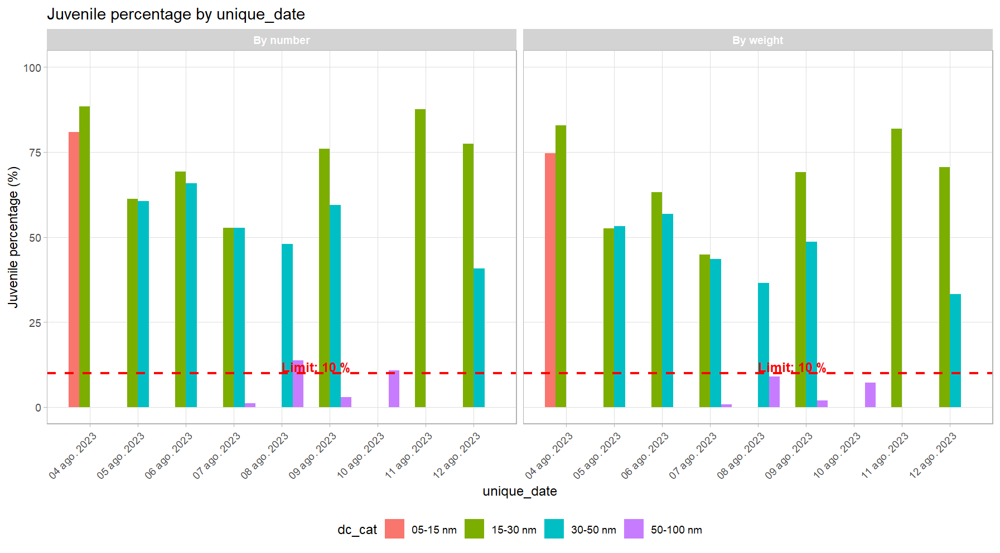

## Tools for Fisheries Data Analysis in Peru

`Tivy` is an R package specialized in processing and analyzing fisheries data from Peru. It facilitates the handling of information from fishing trip logbooks, size records, hauls, and official announcements issued by the Ministry of Production for preventive closures.

## 📋 Main Features

- Loading and processing fishing logbook data
- Integration of haul, size, and fishing trip data
- Estimation of juvenile proportions
- Analysis of preventive closures
- Interactive visualization of fishing areas and results
- Tools for fisheries statistical modeling

## 📦 Installation

You can install the development version of `Tivy` from GitHub:

```r
# install.packages("devtools")
devtools::install_github("HansTtito/Tivy")
```

## 🚀 Usage Examples

### Basic Loading and Processing

```r
library(Tivy)

# Load and process logbook files
data_hauls <- process_hauls(data_hauls = calas_bitacora, 
                            format = "xlsx", 
                            correct_coordinates = TRUE)

data_fishing_trips <- process_fishing_trips(data_fishing_trips = faenas_bitacora, 
                              format = "xlsx")

hauls_length <- process_length(data_length = tallas_bitacora, 
                               format = "xlsx")
```

### Data Integration

```r
# Combination of size and fishing trip data
data_length_fishing_trips <- merge(x = data_fishing_trips, 
                          y = hauls_length, 
                          by = 'fishing_trip_code')

# Complete integration with haul data
data_total <- merge_length_fishing_trips_hauls(data_hauls = data_hauls, 
                                       data_length_fishing_trips = data_length_fishing_trips)

# Add derived variables
final_data <- add_variables(data_total)
```

### Juvenile Analysis

```r
# Define size columns
length_cols <- as.character(seq(8, 15, 0.5))

# Weight length according to catch
final_data_weighted <- weight_length_df(
  final_data, 
  length_cols = length_cols, 
  catch_col = 'catch_ANCHOVETA', 
  a = 0.0012,  # Parameter a of length-weight relationship
  b = 3.1242   # Parameter b of length-weight relationship
)

# Convert dates for temporal grouping
final_data_weighted$unique_date <- convert_to_date(
  final_data_weighted$start_date_haul, 
  type = "date"
)

# Calculate juvenile proportion by date
juvenile_results <- juveniles_by_group(
  data = final_data_weighted, 
  group_cols = c("unique_date"), 
  cols_length = paste0("pond_", length_cols)
)
```

### Visualization of Results

```r
# Basic plot of juveniles by date
plot_juveniles(
  juvenile_data = juvenile_results, 
  var_x = c("unique_date"),
  juv_limit = 12  # Legal minimum size (cm)
)
```



```r
# Complete dashboard of juvenile analysis
final_data_weighted$catch_t = final_data_weighted$catch_ANCHOVETA/1000

dashboard = juveniles_dashboard(
  data_total = final_data_weighted,
  col_date = "unique_date", 
  cols_length = paste0("pond_",seq(8,15,0.5)), 
  juv_limit = 12,
  a = 0.0001, b = 2.984, 
  col_latitude = "lat_final",
  col_longitude = "lon_final", 
  col_catch = "catch_t",
  col_juveniles = "juv",
  show_limit_juv = TRUE
)

# View individual dashboard components
dashboard$comparison  # Juvenile comparison
dashboard$relation  # Relationship juveniles ~ Time
dashboard$cumulative_catch  # Cumulative catch
dashboard$juveniles_map # Juvenile map

dashboard$dashboard    # Complete panel with all plots
```


### Analysis of Official Announcements

```r
# Example with URLs of announcements from the Ministry of Production
pdf_urls <- c(
  "https://consultasenlinea.produce.gob.pe/produce/descarga/comunicados/dgsfs/1542_comunicado1.pdf",
  "https://consultasenlinea.produce.gob.pe/produce/descarga/comunicados/dgsfs/1478_comunicado1.pdf",
  "https://consultasenlinea.produce.gob.pe/produce/descarga/comunicados/dgsfs/1468_comunicado1.pdf"
)

# Extract information from announcements
results <- extract_announcement_data(vector_pdf_names = pdf_urls)

# Format data for visualization
formatted_results <- format_announcement_data(results)

# Visualize closed areas with ggplot
plot_polygons_ggplot(data = formatted_results, show_legend = TRUE)
```


```r
# Interactive visualization with leaflet
interactive_map <- plot_polygons_leaflet(data = formatted_results, show_legend = TRUE)
interactive_map
```


## 📊 Recommended Workflow

1. Load and process haul, fishing trip, and size data
2. Integrate the data using the merge functions
3. Calculate derived variables and perform weightings
4. Analyze the proportion of juveniles by zones or seasons
5. Visualize results through plots or dashboards
6. Integrate with preventive closure information

## 📄 Supported Data Structure

`Tivy` is designed to work with the data structure of Peru's Ministry of Production. Typical input files include:

- **Haul logbooks**: Records of fishing operations.
- **Fishing trip logbooks**: Information on trips and vessels.
- **Size records**: Biometric measurements of captured species.
- **Official announcements**: PDF documents with information on preventive closures.

## 🔧 Main Functions

| Category | Functions | Description |
|-----------|-----------|-------------|
| Processing | `process_hauls()`, `process_fishing_trips()`, `process_length()` | Data loading and cleaning |
| Integration | `merge_length_fishing_trips_hauls()`, `add_variables()` | Data combination and enrichment |
| Juveniles | `weight_length_df()`, `juveniles_by_group()` | Analysis of juvenile proportions |
| Visualization | `plot_juveniles()`, `juveniles_dashboard()` | Creation of plots and dashboards |
| Announcements | `extract_announcement_data()`, `format_announcement_data()` | Processing of official announcements |
| Maps | `plot_polygons_ggplot()`, `plot_polygons_leaflet()` | Geospatial visualization |

## 👩‍💻 Contributions

Contributions are welcome. Please consider:

1. Opening an issue to discuss important changes
2. Following the project's code style
3. Including tests for new features
4. Updating the corresponding documentation

## 📚 Citation

If you use `Tivy` in your research, please cite it as:

```
Ttito, H. (2025). Tivy: Tools for Fisheries Data Analysis in Peru. R package version 0.1.0.
https://github.com/HansTtito/Tivy
```