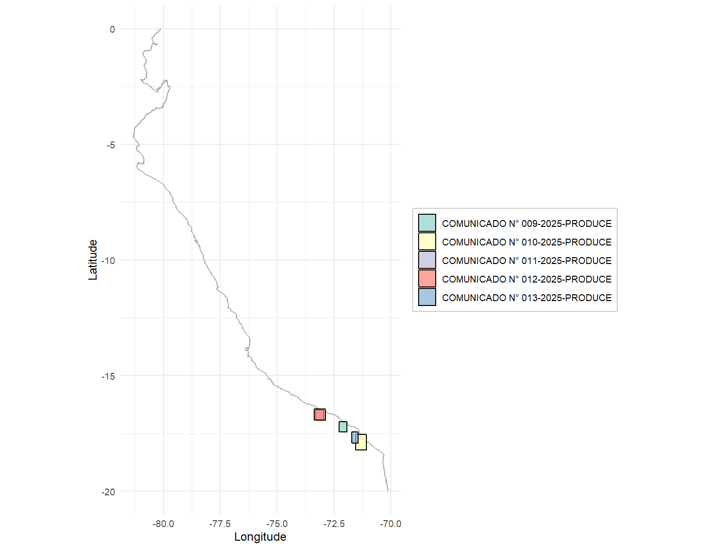

# Tivy

<!-- badges: start -->
[](https://github.com/HansTtito/Tivy/actions)
[](https://CRAN.R-project.org/package=Tivy)
[](https://lifecycle.r-lib.org/articles/stages.html#stable)
<!-- badges: end -->

## Tools for Fisheries Data Analysis in Peru

`Tivy` is an R package specialized in processing and analyzing fisheries data from Peru's Ministry of Production (PRODUCE). It facilitates the handling of information from fishing trip logbooks, size records, hauls, and official announcements issued for preventive closures.

## 📋 Main Features

- 🐟 **Data Processing**: Automated processing of fishing hauls, trips, and length frequency data
- 🗺️ **Spatial Analysis**: Coordinate conversion, distance calculations, and fishing zone analysis  
- 📊 **Juvenile Analysis**: Fish population structure analysis with length-weight relationships
- 📈 **Visualization**: Static (ggplot2) and interactive (leaflet) mapping capabilities
- 📋 **Regulatory Integration**: Processing of official fishing closure announcements
- 🇵🇪 **Peru-Specific**: Tailored for PRODUCE's SITRAPESCA system and Peruvian waters

## 📦 Installation

You can install the development version of `Tivy` from GitHub:

```r
# install.packages("devtools")
devtools::install_github("HansTtito/Tivy")
```

## 🚀 Usage Examples

### Basic Loading and Processing

```r
library(Tivy)

# Load and process logbook files
data_hauls <- process_hauls(
  data_hauls = calas_bitacora,
  correct_coordinates = TRUE,
  verbose = TRUE
)

data_fishing_trips <- process_fishing_trips(
  data_fishing_trips = faenas_bitacora,
  verbose = TRUE
)

hauls_length <- process_length(
  data_length = tallas_bitacora,
  verbose = TRUE
)
```

### Data Integration

```r
# Combination of length and fishing trip data
data_length_fishing_trips <- merge(
  x = data_fishing_trips,
  y = hauls_length,
  by = 'fishing_trip_code',
  all = TRUE
)

# Complete integration with haul data
data_total <- merge_length_fishing_trips_hauls(
  data_hauls = data_hauls,
  data_length_fishing_trips = data_length_fishing_trips
)

# Add derived variables (juveniles, distance to coast, etc.)
final_data <- add_variables(
  data = data_total,
  JuvLim = 12,  # Juvenile threshold in cm
  distance_type = "haversine",
  unit = "nm"
)
```

### Juvenile Analysis

```r
# Define length columns automatically
length_cols <- find_columns_by_pattern(final_data, pattern = "weighted_")

# Or define manually
length_cols <- as.character(seq(from = 8, to = 15, by = 0.5))

# Length-weight relationship parameters (for anchoveta)
a <- 0.0001
b <- 2.983

# Weight length frequencies according to catch
final_data_weighted <- apply_catch_weighting(
  data = final_data,
  length_cols = length_cols,
  catch_col = 'catch',
  a = a,  # Length-weight coefficient
  b = b   # Length-weight exponent
)

# Calculate juvenile proportion by group
juvenile_results <- summarize_juveniles_by_group(
  data = final_data_weighted,
  group_cols = c("dc_cat"),  # Distance category
  length_cols = paste0("weighted_", length_cols),
  juvenile_limit = 12,
  a = a,
  b = b
)

print(juvenile_results)
```

### Visualization of Results

```r
# Basic plot of juveniles by date
juvenile_plot <- plot_juvenile_analysis(
  data = final_data_weighted,
  x_var = "start_date_haul",
  fill_var = "dc_cat",
  length_cols = paste0("weighted_", length_cols),
  a = a,
  b = b,
  x_date_breaks = "1 day",
  plot_type = "bars",
  use_facet_wrap = TRUE,
  reference_line = 10
)

print(juvenile_plot)
```


```r
# Complete dashboard of juvenile analysis
final_data_weighted$catch_t <- final_data_weighted$catch / 1000

dashboard <- create_fishery_dashboard(
  data = final_data_weighted,
  date_col = "start_date_haul",
  length_cols = paste0("weighted_", length_cols),
  a = a,
  b = b,
  latitude_col = "lat_initial",
  longitude_col = "lon_initial",
  catch_col = "catch_t",
  juvenile_col = "juv",
  date_breaks = "1 day"
)

# View individual dashboard components
dashboard$comparison      # Juvenile comparison
dashboard$trends         # Juvenile trends over time
dashboard$catch_trends   # Cumulative catch
dashboard$spatial_map    # Spatial distribution map
dashboard$dashboard      # Complete panel with all plots
```


### Analysis of Official Announcements

```r
# Fetch announcements from PRODUCE website
pdf_announcements <- fetch_fishing_announcements(
  start_date = "01/03/2025",
  end_date = "31/03/2025",  
  download = FALSE  # Set TRUE to download PDF files
)

print(pdf_announcements)

# Extract information from PDF announcements
results <- extract_pdf_data(
  pdf_sources = pdf_announcements$DownloadURL
)

# Format data for visualization
formatted_results <- format_extracted_data(
  data = results,
  convert_coordinates = TRUE
)

# Visualize closed areas with ggplot (static)
static_plot <- plot_fishing_zones(
  data = formatted_results,
  type = "static",
  show_legend = TRUE,
  title = "Fishing Closure Areas"
)

print(static_plot)
```



```r
# Interactive visualization with leaflet
interactive_map <- plot_fishing_zones(
  data = formatted_results,
  type = "interactive",
  show_legend = TRUE,
  base_layers = TRUE,
  minimap = TRUE
)

interactive_map
```


## 📊 Recommended Workflow

1. **Load and process** haul, fishing trip, and length data using `process_*()` functions
2. **Integrate datasets** using `merge_length_fishing_trips_hauls()`
3. **Add derived variables** with `add_variables()` (distances, juveniles, etc.)
4. **Apply catch weighting** using `apply_catch_weighting()` for biomass analysis
5. **Analyze juvenile proportions** by zones or seasons with `summarize_juveniles_by_group()`
6. **Visualize results** through `plot_juvenile_analysis()` or `create_fishery_dashboard()`
7. **Integrate regulatory data** using announcement processing functions

## 📄 Supported Data Structure

`Tivy` is designed to work with the data structure of Peru's Ministry of Production (PRODUCE). Typical input files include:

- **Haul logbooks** (`calas`): Records of fishing operations with coordinates and catch data
- **Fishing trip logbooks** (`faenas`): Information on trips, vessels, and dates
- **Length records** (`tallas`): Biometric measurements and frequency data of captured species
- **Official announcements**: PDF documents with information on preventive closures

## 🔧 Main Functions

| Category | Functions | Description |
|-----------|-----------|-------------|
| **Data Processing** | `process_hauls()`, `process_fishing_trips()`, `process_length()` | Data loading, cleaning, and standardization |
| **Data Integration** | `merge_length_fishing_trips_hauls()`, `add_variables()` | Data combination and variable enrichment |
| **Spatial Analysis** | `dms_to_decimal()`, `coast_distance()`, `land_points()` | Coordinate conversion and spatial calculations |
| **Juvenile Analysis** | `apply_catch_weighting()`, `summarize_juveniles_by_group()`, `calculate_fish_weight()` | Population structure and juvenile proportion analysis |
| **Visualization** | `plot_juvenile_analysis()`, `plot_fishing_zones()`, `create_fishery_dashboard()` | Static and interactive plotting |
| **Announcements** | `fetch_fishing_announcements()`, `extract_pdf_data()`, `format_extracted_data()` | Processing of official regulatory announcements |
| **Quality Control** | `validate_haul_data()`, `validate_fishing_trip_data()`, `validate_length_data()` | Data quality assessment and validation |

## 📚 Documentation

Comprehensive documentation is available through vignettes:

```r
# Overview and quick start
vignette("introduction", package = "Tivy")

# Detailed data processing workflows  
vignette("data-processing", package = "Tivy")

# Spatial analysis and mapping
vignette("spatial-analysis", package = "Tivy")

# Fish population analysis
vignette("juvenile-analysis", package = "Tivy")
```

## Built-in Datasets

- `peru_coastline`: Peruvian coastline coordinates for spatial analysis
- `peru_coast_parallels`: Parallel lines at different nautical mile distances from shore

## Requirements

- R >= 4.0.0
- Required packages: dplyr, tidyr, lubridate, stringr, ggplot2, leaflet, RColorBrewer
- Suggested packages: future, patchwork, rnaturalearth (for enhanced functionality)

## 👩‍💻 Contributions

Contributions are welcome! Please consider:

1. Opening an issue to discuss important changes
2. Following the project's code style
3. Including tests for new features
4. Updating the corresponding documentation

## 📚 Citation

If you use `Tivy` in your research, please cite it as:

```
Ttito, H. (2025). Tivy: Tools for Fisheries Data Analysis in Peru. 
R package version 0.1.0. https://github.com/HansTtito/Tivy
```

## License

This project is licensed under the GPL-3 License - see the [LICENSE](LICENSE) file for details.

## Support

- 📖 **Documentation**: See package vignettes and function help pages
- 🐛 **Bug reports**: [GitHub Issues](https://github.com/HansTtito/Tivy/issues)  
- 💬 **Questions**: [GitHub Discussions](https://github.com/HansTtito/Tivy/discussions)
- 📧 **Contact**: kvttitos@gmail.com

## Acknowledgments

- Peru's Ministry of Production (PRODUCE) for providing access to fisheries data
- The R community for excellent packages that make this work possible
- Fisheries researchers and managers who provided feedback and requirements